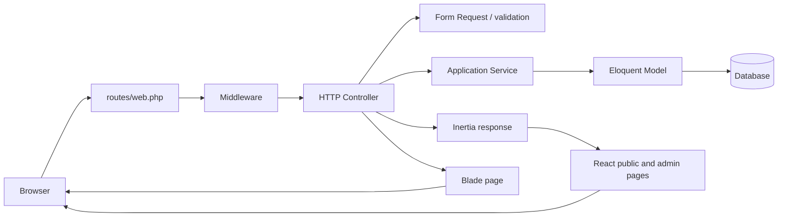
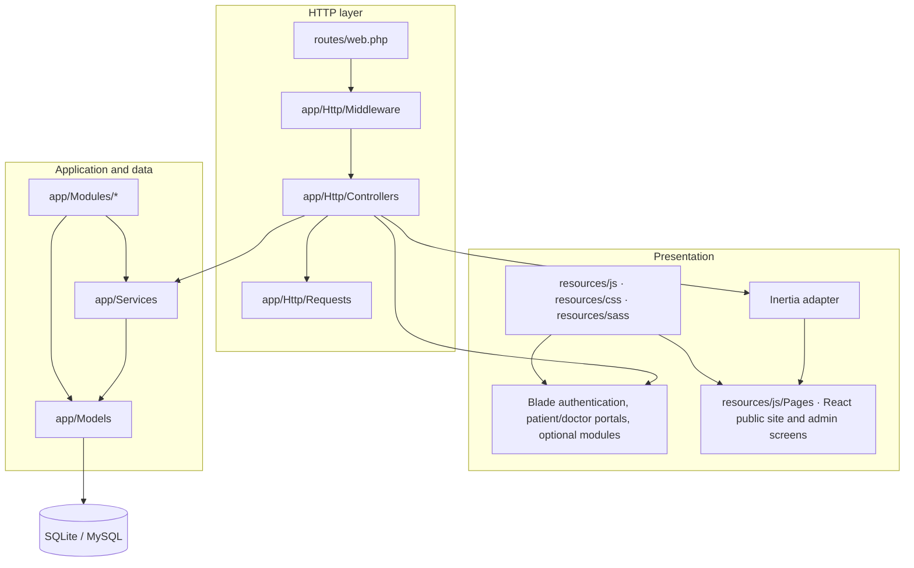
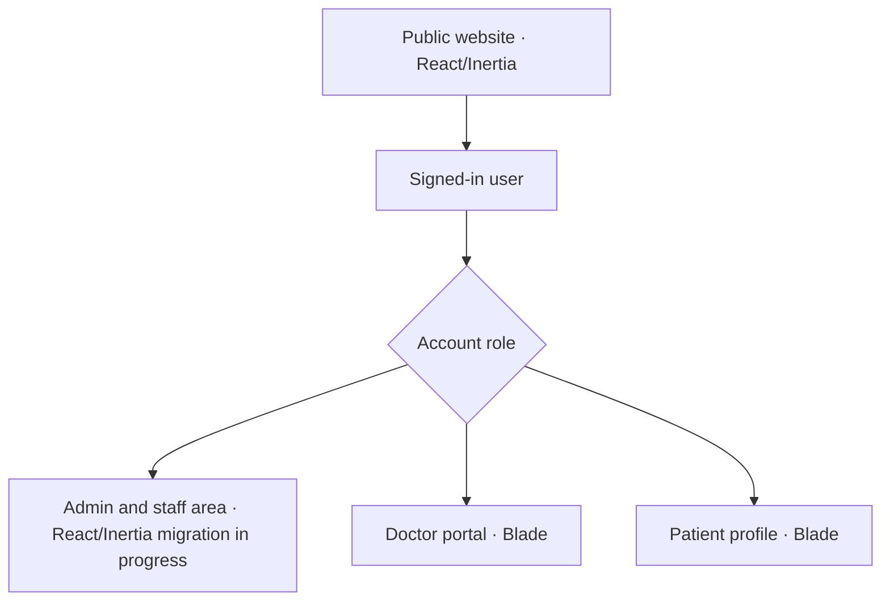

# MediCare Application Structure

## Request and response flow



## Application layers



## Main source directories

```text
app/
├── Console/       Scheduled and command-line tasks
├── Http/
│   ├── Controllers/ HTTP request handlers
│   ├── Middleware/  Request filters and access gates
│   └── Requests/    Input validation
├── Mail/           Email message classes
├── Models/         Core Eloquent models
├── Modules/        Separately organized application modules
├── Notifications/  User notifications
├── Observers/      Model lifecycle observers
├── Providers/      Laravel service providers
├── Services/       Shared application logic
└── Support/        Shared support utilities

database/
├── factories/      Model factories
├── migrations/     Database schema history
└── seeders/        Database seed definitions

resources/
├── css/            Frontend and admin styles
├── js/             Frontend scripts and React public/admin pages
├── sass/           Sass stylesheets
└── views/          Blade templates

routes/
├── web.php         Web routes
└── console.php     Console routes
```

## User-facing areas


