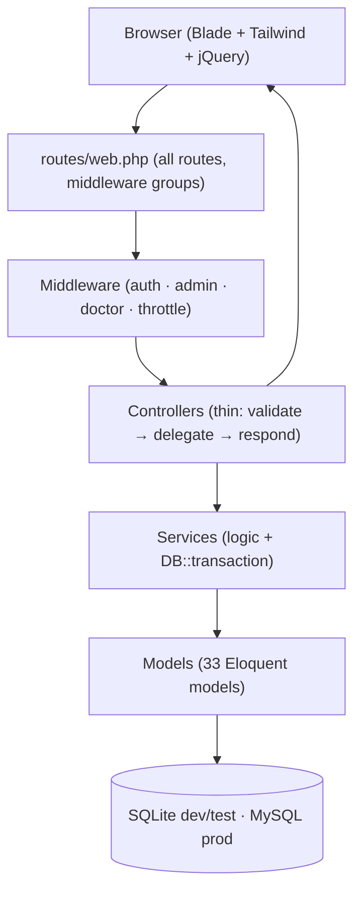
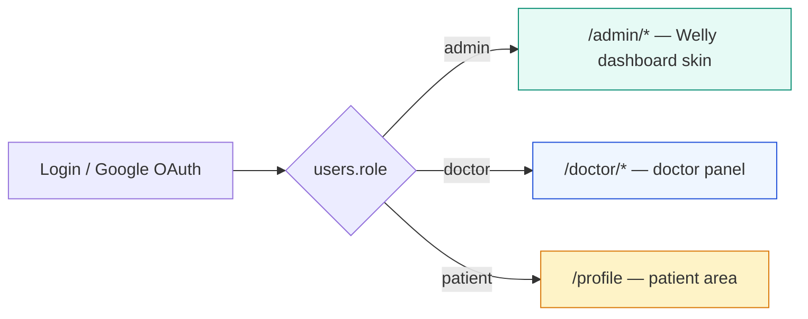

# Laravel Hospital Website — MediCare

## Requirements
- PHP: 8.3 or higher (composer requires `^8.3`)
- Composer: Latest version
- Laravel: 13.x (`laravel/framework ^13.0`)
- MySQL: 5.7 or higher (or SQLite for testing)
- Node.js 18+ / Vite 8 (for `bootstrap 5.3.2` + frontend assets)

---

## Architecture (visual overview)

Layered MVC — HTTP never touches the database directly; Blade never holds business logic:



One `users` table, three roles — login redirects by role:



---

## Features — Complete

### Frontend (public + auth routes)
| Method | URI | Name | Description |
|--------|-----|------|-------------|
| GET | `/` | `home` | Hero slider (Sliders), about, counter up, services, brand, testimonials, blog preview — data from `home_settings`, `general_settings`, `doctors`, `blogs` |
| GET | `/about` | `about` | CMS `about_settings` + hospital history images |
| GET | `/service` | `service` | Services page (`frontend.service`) + emergency/prevention sections |
| GET | `/doctor` | `doctor` | Doctors list with pagination, department filter |
| GET | `/doctor/{id}` | `doctor.show` | Doctor detail (degree, specialist, services, availability, phone) |
| GET | `/blog` | `blog` | Blog list with `category`/`tag` filter, `search`, pagination |
| GET | `/blog/{slug}` | `blog.show` | Blog detail + approved comments, recent posts, social share, comment form |
| POST | `/blog/{blog_id}/comment` | `blog.comment.store` | `throttle:10,1` guest comment → `status=0` pending moderation |
| GET | `/contact` | `contact` | Contact info + form |
| POST | `/contact-submit` | `contact.submit` | `throttle:10,1` contact form → mail `MAIL_*` + `contact_settings` |
| GET | `/appointment` | `appointment` | Booking form (doctor select, date, `GET /get-available-slots`, visit_type 1/2/3, age/gender/phone/email) |
| POST | `/appointment` | `appointment.store` | `throttle:10,1` creates `appointments` (`doctor_id, patient_name, age, gender, phone, email, visit_type, appointment_date, time_slot_id, status=0, cancellation_token`) — works for guest & `auth` user (`user_id`) |
| GET | `/get-available-slots` | `get.slots` | AJAX: returns free `time_slots` for doctor+date |
| GET | `/appointment/cancel/{token}` | `appointment.cancel-page` | `throttle:10,1` guest cancel form via `cancellation_token` |
| PUT | `/appointment/cancel/{token}` | `appointment.cancel-by-token` | Guest cancel → `status=3` |
| GET | `/profile` | `profile` | `auth` patient profile — tabs `My Profile` / `My Appointments` (`with doctor,timeSlot`) / `My Lab Reports` |
| PUT | `/profile` | `profile.update` | Update patient profile (phone, DOB, gender, blood_group, address, profile_image) |
| PATCH | `/appointment/{appointment}/cancel` | `appointment.cancel` | `auth` patient cancel own appointment |
| GET | `/profile/lab-reports/{report}/download` | `profile.lab-reports.download` | `auth` download own lab report file (own-records-only scoping) |
| GET | `/profile/lab-orders/{order}/pdf` | `profile.lab-orders.pdf` | `auth` PDF of own lab order (dompdf) |
| GET | `/profile/blood-requests` | `profile.blood-requests` | `auth` patient "My Blood Requests" page — own requests + issued blood history |

**Frontend extras:** Responsive header (appointment CTA), breadcrumb, footer (departments/contact), `owl.carousel`, `daterangepicker`, `magnific-popup`, `counterup`, brand clients. Patient account: `Auth::routes` register/login + **Google OAuth** `GET /auth/google` (`auth.google.redirect`) → `GET /auth/google/callback` (`auth.google.callback`) via `laravel/socialite ^5.30` — auto-creates `patient`, links existing email, sets `email_verified_at`, stores `google_id/provider/avatar`, `password` nullable, preserves `role` (no escalation), redirects by role.

### Admin Panel — Welly skin, Tailwind v4 + Vite (`admin` middleware)
| Method | URI | Name | Description |
|--------|-----|------|-------------|
| GET | `/admin` | `admin.home` | **Dashboard** (Welly): 4 gold-trim stats (today's appointments / patients / doctors / earning), Patient Percentage donut with Daily/Weekly/Monthly real-data tabs, browsable booking calendar (`?cal=YYYY-MM`) + upcoming schedule with approve/cancel, Patient Overview 6-month bars, Revenue + Invoice KPIs, status bars, today's register, doctor load, pending comments |
| GET/POST | `/admin/settings/general` | `settings.general` / `update` | Site name, logo (200x60), favicon (32x32), header address/hours/socials (facebook/twitter/linkedin/youtube), footer logo/phone/email/description/copyright |
| GET/POST | `/admin/settings/home` | `settings.home` | Home about, counter numbers, etc. |
| GET | `/admin/settings/about` | `settings.about` | About CMS |
| GET | `/admin/settings/service` | `settings.service` | Service CMS |
| GET | `/admin/settings/doctor` | `settings.doctor` | Doctor section CMS |
| GET | `/admin/settings/blog` | `settings.blog` | Blog section CMS |
| GET | `/admin/settings/contact` | `settings.contact` | Contact CMS |
| POST | `/admin/seo-settings` | `admin.seo-settings.update` | SEO for home/about/service/doctor/blog/contact |
| RESOURCE | `/admin/sliders` | `admin.sliders.*` | `index/create/store/show/edit/update/destroy` — hero slider image/title |
| RESOURCE | `/admin/departments` | `admin.departments.*` | Department `name, description, status` |
| RESOURCE | `/admin/doctors` | `admin.doctors.*` | Doctor `name/slug/degree/department/specialist/image/services/availability/phone/status` + creates linked `User` (`email, password, role=doctor`) — `custom-file`→`form-control` BS5 |
| RESOURCE | `/admin/time-slots` | `admin.time-slots.*` | TimeSlot `time, status` (used by appointments) |
| RESOURCE | `/admin/appointments` | `admin.appointments.*` | Full CRUD, status 0 pending/1 confirmed/2 completed/3 cancelled, relations `doctor/user/timeSlot`, `email+cancellation_token`, search `?search=` |
| RESOURCE | `/admin/patients` | `admin.patients.*` | Patient list/show/edit (user + appointments) |
| RESOURCE | `/admin/blogs` | `admin.blogs.*` | Blog `title/slug/excerpt/content/image/author/status/category/tags` Summernote `bs5` |
| RESOURCE | `/admin/blog/categories` | `admin.categories.*` | Category `name/slug` |
| RESOURCE | `/admin/blog/tags` | `admin.tags.*` | Tag `name/slug` |
| RESOURCE | `/admin/comments` | `admin.comments.*` | `index/update/destroy` — approve `status 0→1` or delete |

**Laboratory:**
| Method | URI | Name | Description |
|--------|-----|------|-------------|
| RESOURCE | `/admin/lab-tests` | `admin.lab-tests.*` | Lab tests `name/category/price/normal_range/unit/status` |
| GET | `/admin/lab-orders` | `admin.lab-orders.index` | Filterable list (status, priority, search, date) |
| GET | `/admin/lab-orders/{order}` | `admin.lab-orders.show` | Order detail + items + reports |
| PUT | `/admin/lab-orders/{order}/status` | `admin.lab-orders.status` | `pending→in-progress→completed/cancelled` |
| POST | `/admin/lab-orders/{order}/reports` | `admin.lab-orders.reports.store` | Upload a result file to an order |
| GET | `/admin/lab-orders/{order}/pdf` | `admin.lab-orders.pdf` | Order PDF (dompdf) |
| PUT | `/admin/lab-order-items/{item}/result` | `admin.lab-order-items.result` | Per-item result value |
| DELETE | `/admin/lab-reports/{report}` | `admin.lab-reports.destroy` | Remove a report file |
| GET | `/admin/lab-reports/{report}/download` | `admin.lab-reports.download` | Download a report file |
| GET | `/admin/invoices` | `admin.invoices.index` | Invoice list |
| GET | `/admin/invoices/{invoice}` | `admin.invoices.show` | Invoice detail (`INV-YYYY-NNNN`, items, totals) |
| GET | `/admin/invoices/{invoice}/pdf` | `admin.invoices.pdf` | Invoice PDF |
| POST | `/admin/lab-orders/{order}/invoice` | `admin.invoices.create-from-order` | Create invoice from completed order |
| PATCH | `/admin/invoices/{invoice}/status` | `admin.invoices.status` | `pending→paid` |
| DELETE | `/admin/invoices/{invoice}` | `admin.invoices.destroy` | Remove an invoice |

**Blood Bank (Blood Bank feature — STEP 1–15):**
| Method | URI | Name | Description |
|--------|-----|------|-------------|
| GET | `/admin/bloodbank` | `admin.bloodbank.dashboard` | Cards (donors/donations/stock/pending), emergency queue, stock-by-group, recent donations/requests |
| GET | `/admin/bloodbank/inventory` | `admin.bloodbank.inventory` | Derived stock per group + live bag pool (available/reserved, oldest expiry first) |
| PATCH | `/admin/bloodbank/settings` | `admin.bloodbank.settings.update` | `low_stock_threshold`, `min_donation_days` |
| RESOURCE | `/admin/blood-groups` | `admin.blood-groups.*` | CRUD + `toggle` — usage counts, delete blocked while referenced |
| RESOURCE | `/admin/blood-donors` | `admin.blood-donors.*` | CRUD + show — search (name/phone/email), group/gender/status filters, donation history + eligibility |
| RESOURCE | `/admin/blood-donations` | `admin.blood-donations.*` | CRUD + `status` PATCH (`collected/testing→available/rejected` via `BloodBankService`) |
| GET/POST | `/admin/blood-requests` | `admin.blood-requests.*` | List/create; show = requested vs available vs reserved, issue history |
| POST | `/admin/blood-requests/{r}/approve` | `admin.blood-requests.approve` | Reserve oldest-expiry bags (`lockForUpdate` + transaction); partial → `partially_approved` |
| POST | `/admin/blood-requests/{r}/reject` | `admin.blood-requests.reject` | Release reserved bags, mark rejected |
| POST | `/admin/blood-requests/{r}/cancel` | `admin.blood-requests.cancel` | Release reserved bags, mark cancelled |
| DELETE | `/admin/blood-requests/{r}` | `admin.blood-requests.destroy` | Delete pending only (history kept intact) |
| GET/POST | `/admin/blood-issues` | `admin.blood-issues.*` | Create (`{bloodRequest}`) → `issueForRequest` guards (right bag/not expired/not overweight) → `fulfilled`/`partially_approved`; detail w/ donor + bag |
| GET | `/admin/blood-reports` | `admin.bloodbank.reports` | Period stats, 6-month trend, group inventory |
| GET | `/admin/blood-reports/export/{donations,requests,issues}` | `admin.bloodbank.reports.*` | CSV exports (UTF-8 BOM + formula-injection escaping) |

**System:**
| Method | URI | Name | Description |
|--------|-----|------|-------------|
| GET | `/admin/activity-logs` | `admin.activity-logs.index` | Audit trail — all Eloquent writes logged via `ActivityLogObserver` |
| GET | `/admin/exports/{appointments,patients,lab-orders}` | `admin.exports.*` | CSV exports via `CsvExport` |
| RESOURCE (except show) | `/admin/roles` | `admin.roles.*` | Roles CRUD + grouped permission matrix (`RoleService`, `can:roles.manage`); system roles protected |
| GET/PUT | `/admin/users`, `/admin/users/{user}/edit` | `admin.users.*` | Staff & users register — primary role + RBAC role attach (`can:users.manage`, self-demote blocked) |

**Access control (RBAC):** `roles` / `permissions` / `permission_role` / `role_user` tables + `Role`/`Permission` models; 15 module permissions (`*.manage`, `dashboard.view`, `activity-logs.view`) seeded by `RolePermissionSeeder` (admin/receptionist/lab-technician/pharmacist/doctor/patient defaults); Gates resolved lazily in `AuthServiceProvider` with legacy `admin` superuser bypass; every `/admin/*` route carries a `can:` gate and the sidebar/topbar hide ungranted modules via `@can`; `AdminMiddleware` admits `admin` role or any permission holder; staff logins land on `admin.home`.

### Doctor Panel (`doctor` middleware)
| Method | URI | Name | Description |
|--------|-----|------|-------------|
| GET | `/doctor/dashboard` | `doctor.dashboard` | Stats for own appointments |
| GET | `/doctor/profile` | `doctor.profile.edit` | Profile edit form |
| PUT | `/doctor/profile` | `doctor.profile.update` | Save profile |
| GET | `/doctor/appointments` | `doctor.appointments` | List own appointments |
| PUT | `/doctor/appointments/{appointment}` | `doctor.appointments.update` | Update status `0→1/2` (approve/cancel) |
| GET/POST | `/doctor/lab-orders` | `doctor.lab-orders.index` `/create` `/store` | Create/view lab orders for own patients |
| GET | `/doctor/lab-orders/{order}` | `doctor.lab-orders.show` | Order detail + results |
| GET | `/doctor/blood-requests` | `doctor.blood-requests.index` | Own blood requests |
| GET | `/doctor/blood-requests/create` | `doctor.blood-requests.create` | Raise request — patients limited to doctor's own (via appointments) |
| POST | `/doctor/blood-requests` | `doctor.blood-requests.store` | Submits `pending`; verifies patient belongs to doctor |
| GET | `/doctor/blood-requests/{bloodRequest}` | `doctor.blood-requests.show` | Read-only detail (403 for other doctors' requests) |

### Auth & Brand
- `Auth::routes(['verify'=>false])` + `LoginController::authenticated()` role redirect `admin→admin.home`, `doctor→doctor.dashboard`, `patient→profile` → `home`
- `RegisterController::validator` (`name,email,password confirmed`) + `create()` saves `role=patient` + `Hash::make`
- Google OAuth `GoogleAuthController` handles `google_id` lookup → email link → new `patient` with `Hash::make(Str::random(32))`, `role` never overridden, `avatar` stored
- Brand: frontend `--primary:#05d3b0` `topbar:#049f84` `social:#03856f` Poppins/Montserrat → admin Welly skin (Tailwind v4 `@theme`: teal `#0b8f74`, gold `#c2a15a`, Fraunces + Public Sans, `resources/css/admin.css` via Vite) + `bootstrap-icons 1.10.5` CDN `bootstrap.bundle 5.3.2` + `summernote-bs5` + local `jquery-3.7.0.min.js` + `main.js`

### QA & Tech
- `AppServiceProvider` guards `Schema::hasTable('general_settings')` + try/catch, `remove_order` migrations guard `hasColumn`
- `composer audit: 0`, `php -l: clean`, Pint-formatted, `Route::throttle:10,1` on contact/appointment/comment/cancel, `#[Fillable]` allowlist on all models, no `{!! !!}` XSS
- Scheduled tasks: `appointments:send-reminders` (08:00) + `bloodbank:expire` (02:00 — marks overdue bags expired, releases reservations)

---

## Installation Steps

### Clone Project
```
git clone https://github.com/Risad212/Medicare.git
cd your-project
```

### Install Dependencies
```
composer install
```

### Create Environment File
```
cp .env.example .env
```

### Generate App Key
```
php artisan key:generate
```

### Configure Database (.env)
```
DB_DATABASE=your_database_name
DB_USERNAME=root
DB_PASSWORD=
```

### Run Migrations
```
php artisan migrate
```

### Seed Blood Bank Data (optional — seeds 8 blood groups + inventory settings)
```
php artisan db:seed --class=BloodGroupSeeder
```

### Create Storage Link
```
php artisan storage:link
```

### Google OAuth (Patient)
Add to `.env`:
```
GOOGLE_CLIENT_ID=your-id.apps.googleusercontent.com
GOOGLE_CLIENT_SECRET=your-secret
GOOGLE_REDIRECT_URI="${APP_URL}/auth/google/callback"
```
Create OAuth Client at https://console.cloud.google.com → Credentials → Web application → Authorized redirect URI `http://localhost/auth/google/callback`

### Run Project
```
php artisan serve
# or: composer run dev (serve + queue + pail + vite)
```

---

## Open Project
```
http://127.0.0.1:8000
```

## Admin Panel
```
http://127.0.0.1:8000/admin
```

---

## Important Notes
- Use PHP 8.3+
- Keep assets inside public/ folder
- Always use asset() helper for CSS, JS, images
- File names are case-sensitive
- Configure .env properly before running project
- Run `php artisan storage:link` for image uploads to work

---

## Useful Commands
```
php artisan route:list
php artisan route:list --path=blood
php artisan config:clear
php artisan cache:clear
php artisan view:clear
php artisan migrate:fresh --seed
php artisan db:seed --class=BloodGroupSeeder
php artisan storage:link
php artisan bloodbank:expire          # expire overdue donations daily
composer audit
npm run dev
npm run build
```

---

## Done
Project is ready to run 🚀
