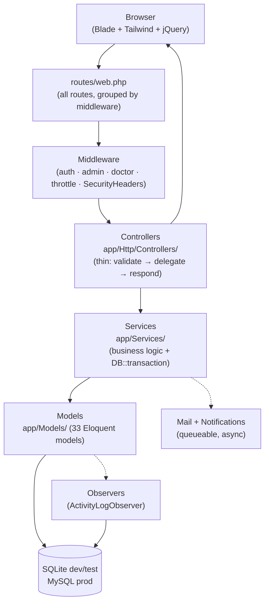
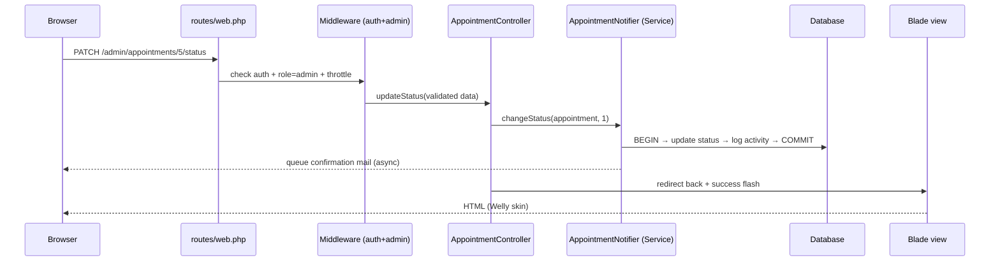
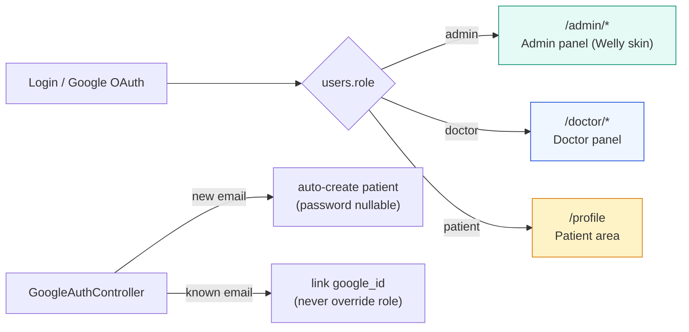
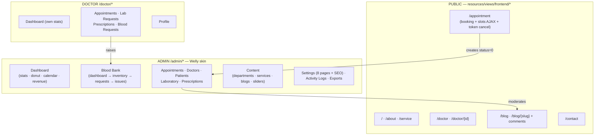
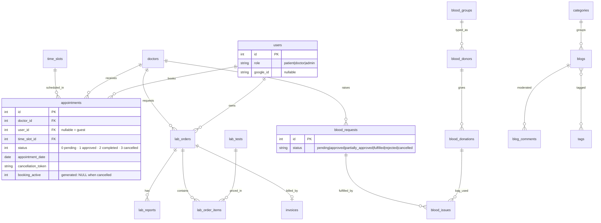
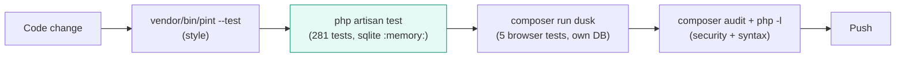

# MediCare — System Architecture Overview

> Visual companion to [ARCHITECTURE.md](ARCHITECTURE.md) (how to **extend** the app without breaking it).
> This file explains how the app **is built today**: layers, request flow, roles, panels, data model, and key lifecycles.
> Diagrams are [Mermaid](https://mermaid.js.org) — they render on GitHub / GitLab / VS Code.

---

## 1. Layered architecture

Every feature is split into the same five layers. HTTP never talks to the database directly; Blade never contains business logic.



**Layer rules**

| Layer | May do | Must NOT do |
|---|---|---|
| `routes/web.php` | Group by middleware, `throttle:10,1` on public POSTs | Contain logic |
| Controller | `$request->validated()`, call Service, return view/redirect | Write 3 tables, send mail, use `all()` |
| Service | Transactions, stock moves, emails, CSV, guards | Return views |
| Model | Relations, scopes, casts, constants | Send mail, touch session |
| Blade | Display only, `{{ }}` escaped, `@csrf` | Queries, `{!! !!}` |

---

## 2. Request lifecycle (sequence)

What happens from click to pixels — e.g. admin approving an appointment:



---

## 3. Roles & access control

One `users` table, three roles. Login redirects by role; every staff route is middleware-gated.



- `Auth::routes(['verify'=>false])` + `LoginController::authenticated()` does the redirect.
- Middleware aliases (`admin`, `doctor`) live in `bootstrap/app.php`; `SecurityHeadersMiddleware` is global.
- Guests can book (`appointments.user_id = NULL`); `GuestRecordLinker` backfills ownership on register / login / Google-link.

---

## 4. The three panels



**Admin shell files** (the Welly redesign):

- `resources/views/backend/layouts/app.blade.php` — HTML frame, fonts, `@vite(['resources/css/admin.css'])`, notif poller.
- `resources/views/backend/layouts/partial/header.blade.php` — white topbar + sidebar, `data-toggle="sidebar|treeview"` hooks for `public/backend-assets/js/main.js`, self-contained avatar menu.
- `resources/css/admin.css` — Tailwind v4 `@theme` tokens + `mc-*` / `welly-*` components; one skin for all 92 backend/doctor views.
- `resources/views/backend/home.blade.php` + `AdminController@index` — the dashboard.

---

## 5. Core data model (ER)



**Two DB-level guarantees worth knowing**

1. `appointments.booking_active` is a *generated* column + unique index — the database itself rejects double-booking; cancelled rows are excluded so slots can be re-booked.
2. Blood reservation uses `lockForUpdate()` inside a transaction (`BloodBankService`) — oldest-expiry bags first, no over-issue under concurrency.

---

## 6. Appointment lifecycle

```mermaid
stateDiagram-v2
    [*] --> Pending : book (guest or patient)
    Pending --> Approved : admin / doctor approves
    Pending --> Cancelled : patient token-cancel / admin cancel
    Approved --> Completed : visit done
    Approved --> Cancelled : admin cancel
    Completed --> [*]
    Cancelled --> [*]
    note right of Pending : reminder cmd 08:00\n(appointments:send-reminders)
```

---

## 7. Blood request lifecycle

```mermaid
stateDiagram-v2
    [*] --> pending : doctor/admin raises
    pending --> approved : reserve bags (oldest expiry)
    pending --> partially_approved : stock short
    pending --> rejected : reject (reservations released)
    approved --> fulfilled : issues cover volume
    approved --> partially_approved : partial issue
    partially_approved --> fulfilled : remaining issued
    approved --> cancelled : cancel (reservations released)
    partially_approved --> cancelled : cancel
    fulfilled --> [*]
    rejected --> [*]
    cancelled --> [*]
    pending --> deleted : delete pending only
    note right of approved : expire cmd 02:00\n(bloodbank:expire releases overdue bags)
```

---

## 8. Testing & quality gates



- Never change the test DB env to MySQL (`phpunit.xml` forces `sqlite :memory:`).
- Dusk uses `database/dusk.sqlite` + `APP_URL=http://127.0.0.1:8089` and boots its own server — never point it at dev MySQL.

---

*Keep the companion guide's rules when adding features: FormRequest + `validated()`, thin controller → `app/Services/*` with `DB::transaction`, Policy/Gate authorize, `throttle:10,1` on public POSTs, additive nullable reversible migrations. See [ARCHITECTURE.md](ARCHITECTURE.md).*
